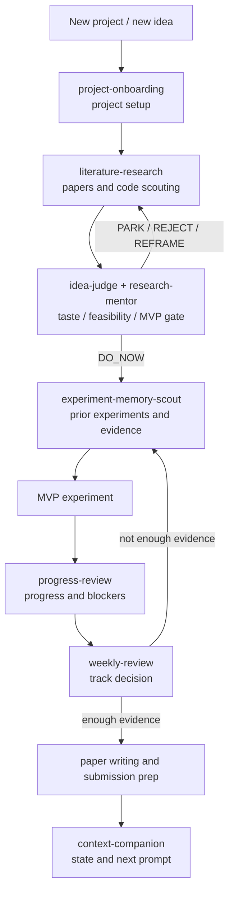
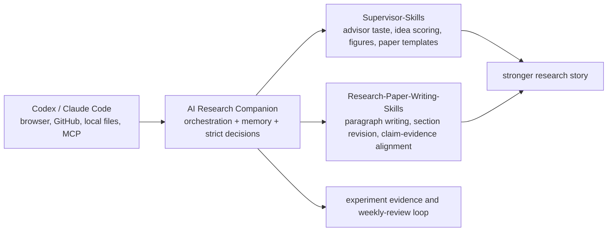

# AI Research Companion

Chinese version: [README.md](README.md)

AI Research Companion is a research workflow plugin for Codex and Claude Code.
It is not a CLI app, server, or standalone product. It is a collection of `SKILL.md`
instructions that an agent can load while working inside your research project folder.

Repository: https://github.com/zengleilei123/ai-research-companion-codex-plugin

## Why This Exists

Most AI coding agents are good at executing a clear task. Research is harder because the key problem is judgment:

- Is this idea actually worth testing, or does it only sound novel?
- Have papers or codebases already validated something similar?
- Is the current experiment testing the core hypothesis, or just adding work?
- When you run experiments in week two or three, does the agent remember what failed last week?
- When should the project move into writing, and when should it park, reject, or reframe?

AI Research Companion is the judgment and memory layer for research workflows. It asks the agent to inspect prior experiments, papers, code references, weekly reviews, and project settings before giving strict advice. After important conversations, it should return three concrete next-step options instead of a vague conclusion.

## Positioning

This repository is an orchestration layer, not a bundle that tries to replace every research skill.



## How It Composes with External Skills

I recommend using the following repositories as optional specialist layers rather than vendoring them into this plugin:

- [HKUSTDial/Supervisor-Skills](https://github.com/HKUSTDial/Supervisor-Skills.git): useful as a second-advisor layer for idea evaluation, paper structure, figure design, and pre-submission review.
- [Master-cai/Research-Paper-Writing-Skills](https://github.com/Master-cai/Research-Paper-Writing-Skills): useful as a paper-writing specialist for Abstract / Introduction / Method / Experiments / Conclusion and claim-evidence checks.



Suggested composition:

| Stage | This plugin handles | Optional external skill |
| --- | --- | --- |
| Project start | `project-onboarding` clarifies problem, resources, baselines, and MVP | Not needed yet |
| Idea judgment | `idea-judge` / `research-mentor` returns DO_NOW, PARK, REJECT, or REFRAME | Supervisor-Skills `idea-evaluator` for a second opinion |
| Survey | `literature-research` finds papers, baselines, code, and novelty risks | Supervisor-Skills `vibe-research-workflow` for AI-assisted research process guidance |
| Experiments | `experiment-memory-scout` avoids duplicate work, `progress-review` checks blockers | Usually not needed unless you are shaping figures or paper story |
| Paper shaping | `weekly-review` decides whether evidence is ready for writing | Supervisor-Skills `tech-paper-template` / `benchmark-paper-template` |
| Figures and presentation | Tracks figure intent and evidence source | Supervisor-Skills `figure-designer` |
| Pre-submission | `context-companion` preserves state | Supervisor-Skills `pre-submission-reviewer`, Research-Paper-Writing-Skills `research-paper-writing` |

> This repository does not vendor those third-party skills by default. Keeping them separate avoids mixing licenses, update cadence, and project boundaries. Install them in your own research project when you want the host agent to see multiple skills at once.

## Quick Start: Codex Plugin

Add this repository as a Codex plugin marketplace:

```bash
codex plugin marketplace add https://github.com/zengleilei123/ai-research-companion-codex-plugin.git --sparse .agents/plugins
```

Restart Codex, open Plugins, and install:

```text
AI Research Companion
```

Then open Codex inside your research project and ask naturally:

```text
I have a new research idea. First onboard the project, then strictly judge whether it is worth an MVP, and give me three next-step options.
```

You can also invoke a bundled skill explicitly:

```text
$ai-research-companion:research-mentor strictly evaluate this idea's research taste, engineering feasibility, and minimal validation experiment.
$ai-research-companion:literature-research find related papers, baselines, and reference code.
$ai-research-companion:progress-review review current progress, blockers, and prior-week evidence.
```

## Quick Start: Claude Code

Claude Code can load project-level or global skills. Project-level install:

```bash
git clone https://github.com/zengleilei123/ai-research-companion-codex-plugin.git .agent-libs/ai-research-companion
mkdir -p .claude/skills
cp -R .agent-libs/ai-research-companion/plugins/ai-research-companion/skills/* .claude/skills/
```

Start Claude Code from the project root:

```bash
claude
```

Ask naturally:

```text
I am starting a new research project. First set up the project, then check whether I need a paper library, code references, and experiment memory.
```

Or invoke skills explicitly:

```text
/project-onboarding
/research-mentor strictly evaluate this idea.
/literature-research find related papers, baselines, and code.
/weekly-review produce this week's research review.
```

Global install:

```bash
mkdir -p ~/.claude/skills
cp -R plugins/ai-research-companion/skills/* ~/.claude/skills/
```

## Optional: Install External Skills in the Same Research Project

If you want Supervisor-Skills and Research-Paper-Writing-Skills available in the same research project, install them as project-level skills.

Codex project-level example:

```bash
mkdir -p .agents/skills .agent-libs
git clone https://github.com/HKUSTDial/Supervisor-Skills.git .agent-libs/Supervisor-Skills
git clone https://github.com/Master-cai/Research-Paper-Writing-Skills.git .agent-libs/Research-Paper-Writing-Skills

cp -R .agent-libs/Supervisor-Skills/plugins/phd-research/skills/idea-evaluator .agents/skills/
cp -R .agent-libs/Supervisor-Skills/plugins/phd-research/skills/figure-designer .agents/skills/
cp -R .agent-libs/Supervisor-Skills/plugins/phd-research/skills/pre-submission-reviewer .agents/skills/
cp -R .agent-libs/Research-Paper-Writing-Skills/research-paper-writing .agents/skills/
```

Claude Code project-level example:

```bash
mkdir -p .claude/skills .agent-libs
git clone https://github.com/HKUSTDial/Supervisor-Skills.git .agent-libs/Supervisor-Skills
git clone https://github.com/Master-cai/Research-Paper-Writing-Skills.git .agent-libs/Research-Paper-Writing-Skills

cp -R .agent-libs/Supervisor-Skills/plugins/phd-research/skills/idea-evaluator .claude/skills/
cp -R .agent-libs/Supervisor-Skills/plugins/phd-research/skills/figure-designer .claude/skills/
cp -R .agent-libs/Supervisor-Skills/plugins/phd-research/skills/pre-submission-reviewer .claude/skills/
cp -R .agent-libs/Research-Paper-Writing-Skills/research-paper-writing .claude/skills/
```

Suggested natural-language prompt:

```text
First use AI Research Companion to inspect project memory, experiment records, and literature gaps.
If the idea is DO_NOW, call idea-evaluator for a second opinion.
If the project has entered the writing phase, call research-paper-writing to revise the Introduction and run claim-evidence alignment.
```

## Bundled Skills

| Skill | When to use | Output |
| --- | --- | --- |
| `project-onboarding` | New project or unclear project setup | Research target, constraints, baselines, MVP, setup questions |
| `literature-research` | Before idea evaluation or experiments | Papers, code, baselines, novelty risks, reference gaps |
| `research-mentor` | When strict advisor judgment is needed | Engineering/research feasibility, taste judgment, MVP design |
| `idea-judge` | When a raw idea needs a decision | Falsifiable hypothesis, success/failure criteria, DO_NOW/PARK/REJECT/REFRAME |
| `experiment-memory-scout` | Before starting or interpreting experiments | Prior experiments, weekly reviews, similar failures, reusable evidence |
| `progress-review` | When checking project status | Progress, blockers, risks, next actions |
| `weekly-review` | Weekly review | continue / park / reject / reframe decision |
| `context-companion` | Before context compression or agent switching | Current state and next starting prompt |

## Browser and Internet Access

This repository only provides research workflow skills. Web browsing, Chrome control, paper search, and GitHub access come from the host agent:

- Codex App: enable Codex Browser / Chrome / GitHub plugins as needed. These skills can then ask the agent to use those capabilities.
- Claude Code: use the web search, MCP, browser, or local tools configured in your Claude Code environment.

AI Research Companion decides when and how to research, evaluate, and organize evidence. The actual network or browser capability depends on your Codex or Claude Code setup.

## Repository Structure

```text
.agents/plugins/marketplace.json
plugins/ai-research-companion/.codex-plugin/plugin.json
plugins/ai-research-companion/skills/
README.md
README.en.md
PUBLISHING.md
```

Do not add these files to this repository:

```text
.research/
experiments/
journal/
knowledge/
references/
templates/
bin/
logs/
secrets/
local databases
personal research notes
```

## References and Acknowledgements

This README's structure is inspired by two open-source skills repositories, and this project recommends using them as optional external specialist layers:

- [HKUSTDial/Supervisor-Skills](https://github.com/HKUSTDial/Supervisor-Skills.git)
- [Master-cai/Research-Paper-Writing-Skills](https://github.com/Master-cai/Research-Paper-Writing-Skills)

This repository does not copy their skill contents. If you install third-party skills in your own project, follow their licenses and attribution requirements.
