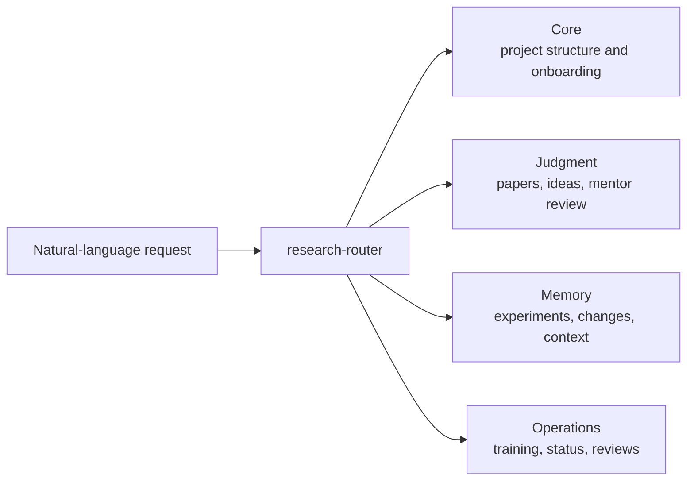

# AI Research Companion

Chinese version: [README.md](README.md)

AI Research Companion is an agent-native research workflow plugin for Codex and Claude Code. It is not a CLI app, service, or standalone product. It is a set of `SKILL.md` files that an agent can load inside your research project to provide strict judgment, project memory, training monitoring, and observability.

Repository: https://github.com/zengleilei123/ai-research-companion-codex-plugin

## What It Solves

The plugin protects the judgment chain that is easy to lose during research:

- whether an idea is worth testing, not only whether it sounds novel
- whether one paper has real taste in problem, contribution, experiments, and failure cases
- whether related papers, code, and baselines already cover the idea
- whether the current experiment tests the core hypothesis
- whether a training run should continue, be interrupted, or stop
- whether the project can recover why changes were made after long context

After important conversations, the plugin should give three next-step options instead of a vague conclusion.

## Quick Start

Add this repository as a Codex plugin marketplace:

```bash
codex plugin marketplace add https://github.com/zengleilei123/ai-research-companion-codex-plugin.git --sparse .agents/plugins
```

Restart Codex, open Plugins, and install `AI Research Companion`. Then open Codex in your research project and ask naturally:

```text
I have a new research idea. First onboard the project, then strictly judge whether it is worth an MVP, and give me three next-step options.
```

Claude Code project-level install:

```bash
git clone https://github.com/zengleilei123/ai-research-companion-codex-plugin.git .agent-libs/ai-research-companion
mkdir -p .claude/skills
cp -R .agent-libs/ai-research-companion/plugins/ai-research-companion/skills/* .claude/skills/
```

Start `claude` from the project root and use natural language.

## Four-Layer Architecture



| Layer | Skills | Purpose |
| --- | --- | --- |
| Core | `research-router`, `project-schema`, `project-onboarding` | Choose the smallest skill sequence, create project memory, start new projects |
| Judgment | `literature-research`, `paper-taste-review`, `idea-judge`, `research-mentor` | Scout related work, read papers for taste, judge idea quality and MVP feasibility |
| Memory | `experiment-memory-scout`, `change-memory`, `context-companion` | Check prior experiments, record why changes happened, preserve handoff state |
| Operations | `training-monitor`, `status-board`, `progress-review`, `weekly-review` | Monitor training, show project bars, review progress, run weekly decisions |

## Common Natural-Language Prompts

```text
Initialize this research project and ask me at most three key setup questions.
```

```text
Use Taste Skill to read this paper, focusing on academic taste, engineering taste, failure cases, and follow-up experiments.
```

```text
Strictly judge whether this idea is worth an MVP. First check related papers, baselines, and reference code.
```

```text
Inspect the current training run and decide whether to continue, intervene, or stop.
```

```text
Show the current project status board, identify which bars are gaps, and give me three next steps.
```

```text
Record change memory for this session, then write the next context handoff prompt.
```

## Project Memory Layout

`project-schema` maintains these files and directories inside your research project:

```text
.research/settings.yaml
.research/status.md
.research/context/SESSION_STATE.md
.research/context/NEXT_PROMPT.md
.research/changes/index.md
experiments/
journal/
knowledge/paper_cards/
knowledge/literature_reviews/
references/papers/
references/code/
```

These are research-project state files. They should not be committed to this plugin distribution repository.

## Automation Hooks

Natural language is the primary interface. These scripts are internal collectors or advanced automation hooks, not the main product surface.

| Skill | Script | Purpose |
| --- | --- | --- |
| `training-monitor` | `collect_training_signals.py` | Read-only collection of logs, metrics, checkpoints, and GPU signals |
| `status-board` | `collect_status_board.py` | Text/JSON/Markdown project bars for scheduled refresh |
| `change-memory` | `collect_change_signals.py` | Read-only collection of git status, diff stat, and latest commit |

## External Skills

This plugin is an orchestration layer and does not vendor third-party skills. Install these in your own research project when useful:

- [HKUSTDial/Supervisor-Skills](https://github.com/HKUSTDial/Supervisor-Skills.git): second-advisor review, idea scoring, figure design, pre-submission checks.
- [Master-cai/Research-Paper-Writing-Skills](https://github.com/Master-cai/Research-Paper-Writing-Skills): paper writing, section rewriting, claim-evidence alignment.

## Browser and Internet Access

Web browsing, Chrome control, GitHub access, and paper search come from the host agent:

- Codex App: enable Browser / Chrome / GitHub plugins as needed.
- Claude Code: use configured web search, MCP, browser, or local tools.

AI Research Companion decides when to research, how to organize evidence, and how to move the project forward. Actual network capability depends on the host environment.

## Repository Boundary

This repository should only contain plugin distribution files:

```text
.agents/plugins/marketplace.json
.github/workflows/validate.yml
plugins/ai-research-companion/.codex-plugin/plugin.json
plugins/ai-research-companion/skills/
README.md
README.en.md
PUBLISHING.md
```

Do not add these files to this repository:

```text
.research/
experiments/
journal/
knowledge/
references/
templates/
bin/
logs/
secrets/
local databases
personal research notes
```

## References

This project recommends composing with these optional specialist layers, but does not copy their contents:

- [HKUSTDial/Supervisor-Skills](https://github.com/HKUSTDial/Supervisor-Skills.git)
- [Master-cai/Research-Paper-Writing-Skills](https://github.com/Master-cai/Research-Paper-Writing-Skills)
