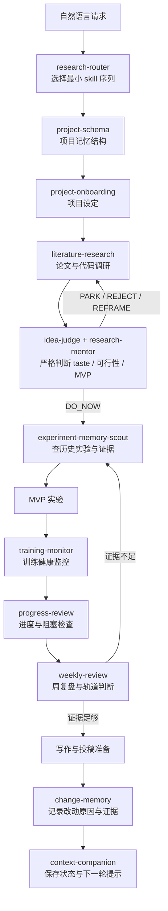
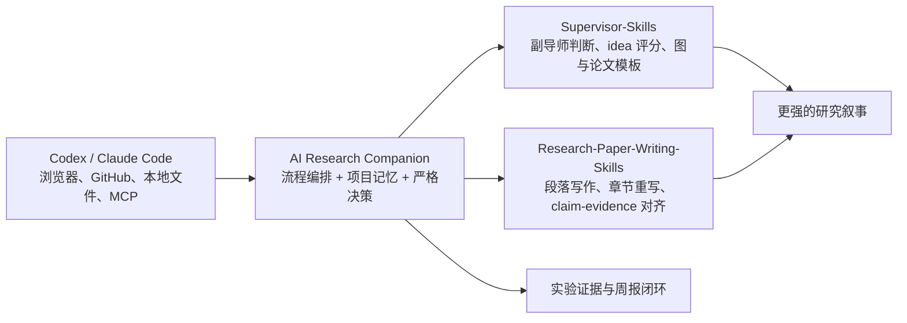

# AI Research Companion

英文版：[README.en.md](README.en.md)

AI Research Companion 是一个面向 Codex / Claude Code 的研究流程插件。它不是 CLI，也不是一个单独运行的服务；它是一组可以被 agent 自动读取的 `SKILL.md`，目标是让 AI 在你的项目文件夹里像一个严格的科研协作者一样工作。

仓库地址：https://github.com/zengleilei123/ai-research-companion-codex-plugin

## 为什么做这个项目

大多数 AI coding agent 很擅长“执行一个明确任务”，但科研里最困难的部分往往不是执行，而是判断：

- 这个 idea 是否真的值得做，而不只是听起来新？
- 有没有已有论文或代码已经做过相似验证？
- 当前实验是在推进核心假设，还是在堆无关工作量？
- 模型训练是否健康，还是已经出现 NaN、OOM、过拟合、停滞或资源浪费？
- 每次修改项目后，是否记得当时为什么这样改、验证过什么、还剩什么风险？
- 第二周、第三周继续做实验时，是否记得上周失败过什么？
- 什么时候应该进入写作，什么时候应该 park / reject / reframe？

AI Research Companion 解决的是研究流程里的“判断与记忆层”。它让 agent 在自然对话中主动检查旧实验、参考论文、代码库、周报和项目设定，然后再给出严格建议。每次关键对话后，它都应该给出三个可选下一步，而不是只给一个笼统结论。

## 项目定位

这个仓库是一个编排层，而不是替代所有科研 skills 的大杂烩。



## 和外部 Skills 如何配合

我建议把下面两个仓库作为“外部专家层”接入，而不是直接复制进本插件仓库：

- [HKUSTDial/Supervisor-Skills](https://github.com/HKUSTDial/Supervisor-Skills.git)：适合作为第二导师视角，用在 idea 评估、论文结构、图设计、投稿前审查。
- [Master-cai/Research-Paper-Writing-Skills](https://github.com/Master-cai/Research-Paper-Writing-Skills)：适合作为论文写作专项技能，用在 Abstract / Introduction / Method / Experiments / Conclusion 和 claim-evidence 检查。



推荐合流方式：

| 阶段 | 本插件负责 | 可选外部 skill |
| --- | --- | --- |
| 自然语言入口 | `research-router` 判断应该先用哪个 skill | 暂不需要 |
| 新项目启动 | `project-schema` 建立研究记忆结构，`project-onboarding` 明确问题、资源、baseline、MVP | 暂不需要 |
| idea 判断 | `idea-judge` / `research-mentor` 给出 DO_NOW、PARK、REJECT、REFRAME | Supervisor-Skills 的 `idea-evaluator` 做第二意见 |
| 调研阶段 | `literature-research` 找论文、baseline、参考代码、新颖性风险 | Supervisor-Skills 的 `vibe-research-workflow` 辅助 AI 科研流程 |
| 实验阶段 | `experiment-memory-scout` 防止重复实验，`training-monitor` 监控训练健康，`progress-review` 检查阻塞，`change-memory` 记录实验配置和修改原因 | 暂不需要，除非要设计图或论文故事 |
| 论文成型 | `weekly-review` 判断是否进入写作 | Supervisor-Skills 的 `tech-paper-template` / `benchmark-paper-template` |
| 图表与表达 | 记录图表需求与证据来源 | Supervisor-Skills 的 `figure-designer` |
| 投稿前 | `context-companion` 固化当前状态 | Supervisor-Skills 的 `pre-submission-reviewer`，Research-Paper-Writing-Skills 的 `research-paper-writing` |

> 注意：本仓库默认不 vendoring 这些第三方 skills。这样可以避免许可证、更新节奏和项目边界混在一起。你可以在自己的研究项目中按需安装它们，让 agent 同时看到多个 skills。

## 快速开始：Codex 插件安装

把这个仓库加入 Codex plugin marketplace：

```bash
codex plugin marketplace add https://github.com/zengleilei123/ai-research-companion-codex-plugin.git --sparse .agents/plugins
```

重启 Codex，在 Plugins 中安装：

```text
AI Research Companion
```

然后进入你的研究项目文件夹，直接自然语言使用：

```text
我有一个新的研究想法。请先做项目设定，然后严格判断它是否值得做 MVP，并给出三个下一步选项。
```

也可以显式点名某个 skill：

```text
$ai-research-companion:research-router 判断我这个请求应该走哪个研究 skill。
$ai-research-companion:project-schema 创建或检查这个项目的研究记忆结构。
$ai-research-companion:research-mentor 严格评估这个 idea 的科研 taste、工程可行性和最小验证实验。
$ai-research-companion:literature-research 帮我找相关论文、baseline 和参考代码库。
$ai-research-companion:training-monitor 检查当前训练 run 是否健康，是否应该继续、干预或停止。
$ai-research-companion:change-memory 记录这次修改改了什么、为什么改、验证过什么、下一步是什么。
$ai-research-companion:progress-review 检查当前项目进度、阻塞和上周实验证据。
```

## 快速开始：Claude Code 使用

Claude Code 可以读取项目级或全局 skills。项目级安装：

```bash
git clone https://github.com/zengleilei123/ai-research-companion-codex-plugin.git .agent-libs/ai-research-companion
mkdir -p .claude/skills
cp -R .agent-libs/ai-research-companion/plugins/ai-research-companion/skills/* .claude/skills/
```

在项目根目录启动 Claude Code：

```bash
claude
```

自然语言触发：

```text
我准备开始一个新的研究项目。请先做项目设定，并检查是否需要补充论文库、代码库和实验记忆。
```

也可以显式调用：

```text
/project-onboarding
/project-schema 创建项目研究结构。
/research-router 判断应该先做调研、idea 评估、训练监控还是进度复盘。
/research-mentor 严格评估这个 idea。
/literature-research 找相关论文、baseline 和代码实现。
/training-monitor 监控当前训练过程。
/change-memory 记录本次项目修改的原因、证据和下一步。
/weekly-review 生成本周研究复盘。
```

全局安装：

```bash
mkdir -p ~/.claude/skills
cp -R plugins/ai-research-companion/skills/* ~/.claude/skills/
```

## 可选：在同一研究项目中安装外部 Skills

如果你想把 Supervisor-Skills 和 Research-Paper-Writing-Skills 接入同一个研究项目，可以放在项目级 skills 目录里。

Codex 项目级示例：

```bash
mkdir -p .agents/skills .agent-libs
git clone https://github.com/HKUSTDial/Supervisor-Skills.git .agent-libs/Supervisor-Skills
git clone https://github.com/Master-cai/Research-Paper-Writing-Skills.git .agent-libs/Research-Paper-Writing-Skills

cp -R .agent-libs/Supervisor-Skills/plugins/phd-research/skills/idea-evaluator .agents/skills/
cp -R .agent-libs/Supervisor-Skills/plugins/phd-research/skills/figure-designer .agents/skills/
cp -R .agent-libs/Supervisor-Skills/plugins/phd-research/skills/pre-submission-reviewer .agents/skills/
cp -R .agent-libs/Research-Paper-Writing-Skills/research-paper-writing .agents/skills/
```

Claude Code 项目级示例：

```bash
mkdir -p .claude/skills .agent-libs
git clone https://github.com/HKUSTDial/Supervisor-Skills.git .agent-libs/Supervisor-Skills
git clone https://github.com/Master-cai/Research-Paper-Writing-Skills.git .agent-libs/Research-Paper-Writing-Skills

cp -R .agent-libs/Supervisor-Skills/plugins/phd-research/skills/idea-evaluator .claude/skills/
cp -R .agent-libs/Supervisor-Skills/plugins/phd-research/skills/figure-designer .claude/skills/
cp -R .agent-libs/Supervisor-Skills/plugins/phd-research/skills/pre-submission-reviewer .claude/skills/
cp -R .agent-libs/Research-Paper-Writing-Skills/research-paper-writing .claude/skills/
```

推荐自然语言用法：

```text
请先用 AI Research Companion 检查当前项目记忆、实验记录和文献缺口。
如果 idea 进入 DO_NOW，再调用 idea-evaluator 做第二意见。
如果已经进入写作阶段，再调用 research-paper-writing 重写 Introduction，并做 claim-evidence 对齐检查。
```

## 自动监控训练过程

当前版本包含 `training-monitor`，用于把训练日志、指标、checkpoint 和资源状态变成研究决策信号。它适合监控：

- loss / val loss / target metric 是否正常收敛
- 是否出现 NaN、Inf、CUDA OOM、进程被 kill、dataloader crash
- checkpoint 是否按预期产生，日志是否长时间没有更新
- train/validation gap 是否显示过拟合
- GPU 利用率、显存、磁盘和 dataloader 是否存在瓶颈
- 当前训练是否支持 MVP 假设，还是需要 stop / restart / reframe

推荐让 agent 在三种模式下使用：

| 模式 | 适合场景 | 用法 |
| --- | --- | --- |
| 按需检查 | 你想知道训练是否还值得继续 | “用 training-monitor 检查这个 run 是否健康” |
| 实验节点检查 | 每个 evaluation / checkpoint 后做判断 | “读取最近日志，判断是否继续跑到下一个 milestone” |
| 自动化巡检 | 长训练、夜间训练、集群任务 | 在 Codex/Claude 的自动化、提醒或外部 cron 中定期触发本 skill |

示例：

```text
$ai-research-companion:training-monitor 检查 experiments/exp_023 和 logs/train.log。
请判断当前训练是否 healthy_continue、watch_closely、intervene_now、stop_or_restart 或 insufficient_signal，并给出三个下一步选项。
```

该 skill 还包含一个只读结构化采集脚本：

```bash
plugins/ai-research-companion/skills/training-monitor/scripts/collect_training_signals.py --run experiments/exp_023 --gpu
```

第一性原则：监控不是为了生成漂亮报表，而是为了减少无效训练时间。训练健康只是工程信号；是否值得继续，还要结合 `experiment-memory-scout` 的历史证据和 `research-mentor` 的假设判断。

## 项目变更记忆

长上下文变慢或被压缩后，最容易丢失的不是代码 diff，而是“为什么当时这么改”。当前版本新增 `change-memory`，用于在你的研究项目中记录每次关键修改：

- 改了哪些文件
- 为什么改
- 看过哪些证据
- 跑过哪些命令或测试
- 做了什么决定
- 还有什么风险
- 下一步应该接什么

它会使用项目内的记忆结构：

```text
.research/changes/index.md
.research/changes/YYYY-MM-DD.md
```

推荐使用方式：

```text
我刚刚完成了一轮实验配置和代码修改，请记录这次 change memory，重点写清楚为什么这样改以及验证过什么。
```

或者在长会话结束前：

```text
请先记录本轮修改的 change memory，然后用 context-companion 写下一轮恢复提示。
```

该 skill 还包含一个只读 git 信号采集脚本：

```bash
plugins/ai-research-companion/skills/change-memory/scripts/collect_change_signals.py --repo . --include-diff-stat
```

第一性原则：git 记录“发生了什么”，change memory 记录“为什么这样做以及下一步该如何继续”。两者应该同时存在。

## 内置 Skills

| Skill | 使用时机 | 产出 |
| --- | --- | --- |
| `research-router` | 自然语言请求很宽泛或多个 skills 都可能适用时 | 最小 skill 序列、首个 skill、后续 skill |
| `project-schema` | 新项目、缺少 `.research/`、experiments、references 或出现 gap 时 | 标准研究工作区结构、starter 文件、schema 风险 |
| `project-onboarding` | 新项目或项目设定不清晰时 | 研究目标、约束、baseline、MVP、项目配置问题 |
| `literature-research` | 评估 idea 或实验前 | 论文、代码、baseline、新颖性风险和参考缺口 |
| `research-mentor` | 需要严格导师判断时 | 工程/科研可行性、taste 判断、MVP 设计 |
| `idea-judge` | 原始 idea 需要决策时 | 可证伪假设、成功/失败标准、DO_NOW/PARK/REJECT/REFRAME |
| `experiment-memory-scout` | 开始或解释实验前 | 历史实验、周报、相似失败、可复用证据 |
| `training-monitor` | 模型训练运行中或训练后 | loss/metric/checkpoint/GPU/异常信号、健康分类、是否继续或干预 |
| `change-memory` | 项目修改后、实验配置变更后、上下文压缩前 | 改动摘要、原因、证据、命令/测试、风险和下一步 |
| `progress-review` | 检查当前项目状态时 | 进度、阻塞、风险、下一步 |
| `weekly-review` | 每周复盘时 | continue / park / reject / reframe 判断 |
| `context-companion` | 上下文压缩或切换 agent 前 | 当前状态、下一轮启动提示 |

## 浏览器和互联网能力

这个仓库本身只提供研究工作流 skills。浏览网页、打开 Chrome、搜索论文、访问 GitHub 等能力来自宿主 agent：

- Codex App：启用 Codex 的 Browser / Chrome / GitHub 等插件后，本插件可以要求 agent 使用这些能力。
- Claude Code：使用 Claude Code 已配置的 web search、MCP、浏览器或本地工具。

也就是说，AI Research Companion 负责“什么时候该调研、怎么判断、如何组织证据”；具体能不能联网、能不能控制浏览器，取决于你的 Codex 或 Claude Code 环境。

## 仓库结构

```text
.agents/plugins/marketplace.json
.github/workflows/validate.yml
plugins/ai-research-companion/.codex-plugin/plugin.json
plugins/ai-research-companion/skills/
README.md
README.en.md
PUBLISHING.md
```

不要把这些内容加入本仓库：

```text
.research/
experiments/
journal/
knowledge/
references/
templates/
bin/
logs/
secrets/
local databases
personal research notes
```

## 参考与致谢

本 README 的结构参考了两个开源 skills 仓库的表达方式，并建议把它们作为可选外部专家层接入：

- [HKUSTDial/Supervisor-Skills](https://github.com/HKUSTDial/Supervisor-Skills.git)
- [Master-cai/Research-Paper-Writing-Skills](https://github.com/Master-cai/Research-Paper-Writing-Skills)

本仓库没有复制它们的 skill 内容。若你在自己的项目中安装第三方 skills，请遵守对应仓库的许可证和归属要求。
