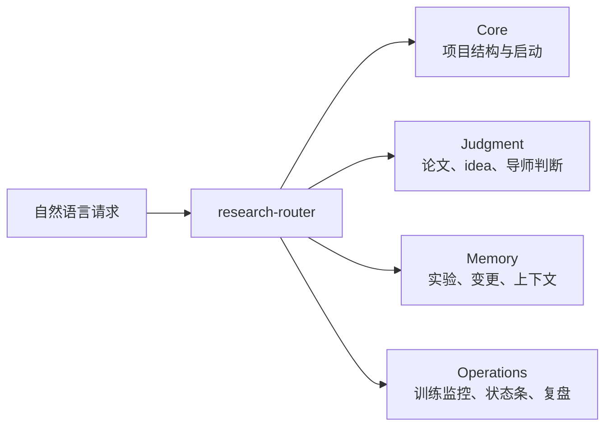

# AI Research Companion

英文版：[README.en.md](README.en.md)

AI Research Companion 是一个面向 Codex / Claude Code 的 agent-native 研究流程插件。它不是 CLI，也不是单独运行的服务；它是一组可被 agent 自动读取的 `SKILL.md`，用于在研究项目中提供严格判断、项目记忆、训练监控和状态可观测。

仓库地址：https://github.com/zengleilei123/ai-research-companion-codex-plugin

## 这个插件解决什么

它关注科研中最容易丢失的判断链：

- idea 是否值得做，而不是只听起来新
- 单篇论文的问题、贡献、实验和 failure case 是否真的有 taste
- 相关论文、代码和 baseline 是否已经覆盖当前想法
- 实验是否在推进核心假设
- 训练过程是否健康，是否应该继续、干预或停止
- 长上下文后是否还能恢复“为什么这样改、下一步做什么”

每次关键对话后，插件应给出三个下一步选项，而不是只给一个笼统结论。

## 快速开始

把仓库加入 Codex plugin marketplace：

```bash
codex plugin marketplace add https://github.com/zengleilei123/ai-research-companion-codex-plugin.git --sparse .agents/plugins
```

重启 Codex，在 Plugins 中安装 `AI Research Companion`。然后进入你的研究项目目录，直接自然语言使用：

```text
我有一个新的研究想法。请先做项目设定，然后严格判断是否值得做 MVP，并给出三个下一步选项。
```

Claude Code 项目级安装：

```bash
git clone https://github.com/zengleilei123/ai-research-companion-codex-plugin.git .agent-libs/ai-research-companion
mkdir -p .claude/skills
cp -R .agent-libs/ai-research-companion/plugins/ai-research-companion/skills/* .claude/skills/
```

然后在项目根目录启动 `claude`，用自然语言触发。

## 四层架构



| 层级 | Skills | 作用 |
| --- | --- | --- |
| Core | `research-router`, `project-schema`, `project-onboarding` | 选择最小 skill 序列，建立项目记忆结构，启动新项目 |
| Judgment | `literature-research`, `paper-taste-review`, `idea-judge`, `research-mentor` | 查相关工作，深读论文，判断 idea taste 和 MVP 可行性 |
| Memory | `experiment-memory-scout`, `change-memory`, `context-companion` | 查历史实验，记录修改原因，保存下一轮恢复提示 |
| Operations | `training-monitor`, `status-board`, `progress-review`, `weekly-review` | 监控训练，展示状态条，检查进度，做周复盘 |

## 常用自然语言

```text
帮我初始化这个研究项目，问我最多三个关键设置问题。
```

```text
用 Taste Skill 读这篇论文，重点判断 academic taste、engineering taste、failure cases 和 follow-up 实验。
```

```text
严格评估这个 idea 是否值得做 MVP。先检查相关论文、baseline 和参考代码。
```

```text
检查当前训练 run 是否健康，判断应该继续、干预还是停止。
```

```text
展示当前项目 status board，指出哪些 bar 是 gap，并给出三个下一步。
```

```text
记录本轮修改的 change memory，然后写下一轮 context handoff prompt。
```

## 项目记忆结构

`project-schema` 会在你的研究项目中维护这些文件和目录：

```text
.research/settings.yaml
.research/status.md
.research/context/SESSION_STATE.md
.research/context/NEXT_PROMPT.md
.research/changes/index.md
experiments/
journal/
knowledge/paper_cards/
knowledge/literature_reviews/
references/papers/
references/code/
```

这些是用户研究项目里的状态文件，不应提交到本插件发布仓库。

## 自动化 Hook

主入口始终是自然语言。下面脚本只作为 agent 内部采集器或高级自动化 hook，不是插件的主要使用方式。

| Skill | 脚本 | 用途 |
| --- | --- | --- |
| `training-monitor` | `collect_training_signals.py` | 只读采集日志、指标、checkpoint、GPU 信号 |
| `status-board` | `collect_status_board.py` | 生成文本/JSON/Markdown 状态条，可用于定时刷新 |
| `change-memory` | `collect_change_signals.py` | 只读采集 git status、diff stat、最新 commit |

## 外部 Skills

本插件是编排层，不 vendoring 第三方 skills。建议按需在你的研究项目里安装：

- [HKUSTDial/Supervisor-Skills](https://github.com/HKUSTDial/Supervisor-Skills.git)：第二导师、idea 评分、图设计、投稿前审查。
- [Master-cai/Research-Paper-Writing-Skills](https://github.com/Master-cai/Research-Paper-Writing-Skills)：论文段落写作、章节重写、claim-evidence 对齐。

## 浏览器和互联网

浏览网页、打开 Chrome、访问 GitHub、搜索论文等能力来自宿主 agent：

- Codex App：启用 Browser / Chrome / GitHub 等插件后，本插件可以要求 agent 使用这些能力。
- Claude Code：使用 Claude Code 已配置的 web search、MCP、浏览器或本地工具。

AI Research Companion 负责判断什么时候该调研、怎么组织证据、如何推进研究；具体联网能力取决于宿主环境。

## 仓库边界

本仓库只包含插件发布内容：

```text
.agents/plugins/marketplace.json
.github/workflows/validate.yml
plugins/ai-research-companion/.codex-plugin/plugin.json
plugins/ai-research-companion/skills/
README.md
README.en.md
PUBLISHING.md
```

不要把这些内容加入本仓库：

```text
.research/
experiments/
journal/
knowledge/
references/
templates/
bin/
logs/
secrets/
local databases
personal research notes
```

## 参考与致谢

本项目建议把以下仓库作为可选专家层组合使用，但不复制其内容：

- [HKUSTDial/Supervisor-Skills](https://github.com/HKUSTDial/Supervisor-Skills.git)
- [Master-cai/Research-Paper-Writing-Skills](https://github.com/Master-cai/Research-Paper-Writing-Skills)
